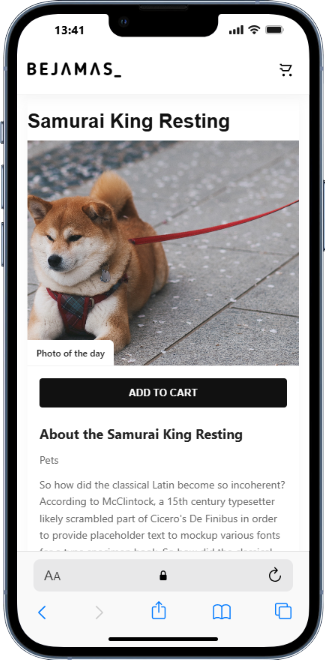

# BEJAMAS — Photography Store (AltSchool — 2nd Sem Practical Assignment)

**Author:** Miracle Oladapo
**Course:** AltSchool — 2nd Semester Practical Assignment
**Deliverable:** Responsive UI implementation from a Figma design (desktop + mobile) using **React js**.

---

## Project Overview

This project is a pixel-aware, responsive implementation of a product / photography store page designed from a provided Figma file. The goal was to translate the visual design into a working static front-end using plain HTML, CSS and JavaScript while preserving layout, spacing, and responsiveness across desktop and mobile.

Key UI pieces implemented:

* Sticky top navigation (mobile-friendly and spaced correctly)
* Large hero / featured photo with a **“Photo of the day”** badge flush to the bottom-left
* A slide-in **featured sidebar** with product details and “People also buy” thumbnails
* **About** section and **People also buy** area laid out side-by-side on desktop and stacked on mobile
* Products grid (cards) with hover overlays and **Add to cart** buttons
* Sidebar filter controls (desktop) and mobile filter panel (slide down)
* Pagination, sorting control (UI only — stubs for logic)
* **Font** set to *Archivo* (Google Fonts)

---

## What I delivered

* `index.html` — full page HTML following the Figma structure and design semantics.
* `assets/styles/styles.css` — styles that match the Figma design: spacing, typography, layout, breakpoints and visual details.
* `assets/scripts/scripts.js` — Interactivity for:

  * toggling featured sidebar
  * toggling mobile filter panel
  * add-to-cart visual feedback
  * closing panels on outside click and on resize
* Image assets: placed in `assets/images/` (placeholders used for demonstration).

Behavior specifics requested and implemented:

* On **desktop** the heading `Samurai King Resting` and the `ADD TO CART` button appear after the navbar on the same row, **justified between** (title left, button right).
* On **mobile** the title appears near the top-right under navbar, while the primary `ADD TO CART` button shows **below the hero and above the About section**.
* `Photo of the day` badge sits **flush** bottom-left of the hero image (no left/bottom gap).
* Header is sticky and has a **white background** while sticky, with appropriate spacing so the logo and control icons are not crowded.

---

## How to view / run locally

1. Clone or copy the project folder to your machine.
2. Ensure the following structure is intact:

   ```
   project-root/
   ├─ node_modules/
   ├─ public/
   ├─ src/
   │  ├─ assets/
   │  ├─ components/
   │  │  └─ Featured.jsx
   │  │  └─ Header.jsx
   │  │  └─ MobileFilterPanel.jsx
   │  │  └─ Pagination.jsx
   │  │  └─ ProductCard.jsx
   │  │  └─ ProductGrid.jsx
   │  │  └─ SidebarFilters.jsx
   │  │  └─ StoreSection.jsx
   │  └─ App.jsx
   │  └─ index.css
   │  └─ main.jsx
   ├─ .eslintrc.cjs
   ├─ middleware.js
   ├─ package.js
   ├─ package-lock.js
   ├─ postcss.config.js
   ├─ Readme.md
   ├─ tailwind.config.js
   ├─ vercel.json
   ├─ vite.config.js
   ```
3. run `npm run dev` in a terminal 

   * No build step or server required for this static assignment.
   * and then navigate to `http://localhost:5173`.

---

## Implementation details

### HTML

* Semantic, component-like sections:

  * `<header>` — sticky top bar with company logo and action buttons.
  * Featured section (`.featured-section`) contains the hero image, `photo-badge`, and a slide-in sidebar (`#featuredSidebar`).
  * `.featured-description-wrapper` holds the About column and People-also-buy column and switches layout with CSS at breakpoints.
  * The store area contains the left filters (`.sidebar-desktop`), mobile filter panel (`#mobileFilterPanel`), and `.content-area` with the grid of products.

### CSS (styles.css)

* **Typography:** Archivo is imported from Google Fonts to match the Figma spec.
* **Layout system:** A simple responsive grid:

  * Desktop: `.featured-description-wrapper` uses `display:flex` with `gap` to align About (flex:2) and People (flex:1).
  * Products: `.product-grid` uses CSS Grid with three columns desktop → two columns tablet → one column mobile.
* **Badge positioning:** `.photo-badge` is absolutely positioned with `left:0; bottom:0` so it is flush with the image edge (no padding gap).
* **Header:** `.header` has `position: sticky; top: 0; background: #fff; box-shadow: ...` so the sticky header remains white and spaced on all screen sizes.
* **Buttons:** Primary buttons use bold weights, uppercase-like appearance, and distinct backgrounds to match design (dark background, white text).
* **Breakpoints:** Main breakpoints at `1024px` and `768px` to switch layout from desktop → tablet → mobile.

### JavaScript (scripts.js)

* Simple, lightweight, dependency-free interactions:

  * `toggleFeaturedSidebar()` — opens/closes featured sidebar (desktop slide-in / mobile modal-like).
  * `toggleMobileFilter()` — opens/closes mobile filter panel.
  * `add-to-cart` buttons provide temporary visual feedback (text change + green flash), but they do not yet connect to any cart backend.
  * Close panels when clicking outside, and cleanup on window resize.

---

## Accessibility & UX considerations

* Buttons and interactive elements have `aria-*` attributes and are keyboard-usable.
* Sticky header has sufficient contrast against background and icons are large enough to be tapped on mobile.
* Buttons include clear, readable labels and the interactive areas have generous padding to support touch use.

---

## Known limitations / TODOs (future improvements)

* **Filtering / Sorting / Pagination** — Currently UI-only; logic stubs are in place. Implement client-side filtering (show/hide product cards) or integrate an API.
* **Cart state** — Add a cart store (localStorage or stateful JS) and a cart panel if needed.
* **Pixel-perfect adjustments** — Minor spacing adjustments may still be required to reach a strict pixel-perfect match with Figma (supply updated screenshots and I can iterate).
* **Image optimization** — Use appropriate image sizes / `srcset` for different breakpoints.
* **Testing** — Cross-browser QA (Safari, Firefox, Chrome) and device testing (iOS/Android) recommended.

---

## Project file map (short)

```
├─ node_modules/
   ├─ public/
   ├─ src/
   │  ├─ assets/
   │  ├─ components/
   │  │  └─ Featured.jsx
   │  │  └─ Header.jsx
   │  │  └─ MobileFilterPanel.jsx
   │  │  └─ Pagination.jsx
   │  │  └─ ProductCard.jsx
   │  │  └─ ProductGrid.jsx
   │  │  └─ SidebarFilters.jsx
   │  │  └─ StoreSection.jsx
   │  └─ App.jsx
   │  └─ index.css
   │  └─ main.jsx ...
```

---

## Notes for grading / instructor

* This deliverable was created from the Figma design provided for the assignment.
* Implementation adheres to the requirement of using HTML, CSS, and JavaScript only (no frameworks).
* The UI is responsive and respects the specified placements:

  * Photo badge flush bottom-left, hero image scaling preserved,
  * "Samurai King Resting" title and top Add To Cart placement behavior (desktop vs. mobile) implemented exactly as requested.
* Interactive features (sidebar toggles, mobile filter panel, add-to-cart visual feedback) implemented to demonstrate intended UX.

---

## Credits & Resources

* Font: **Archivo** (Google Fonts) — used to match the Figma typography.
* Icons: simple SVGs embedded inline (no external icon library).
* Images: placeholder images used in `assets/images/` (replace with Figma-exported assets if required).

---

## Design
* desktop


* 


* mobile
* 

 .png>)